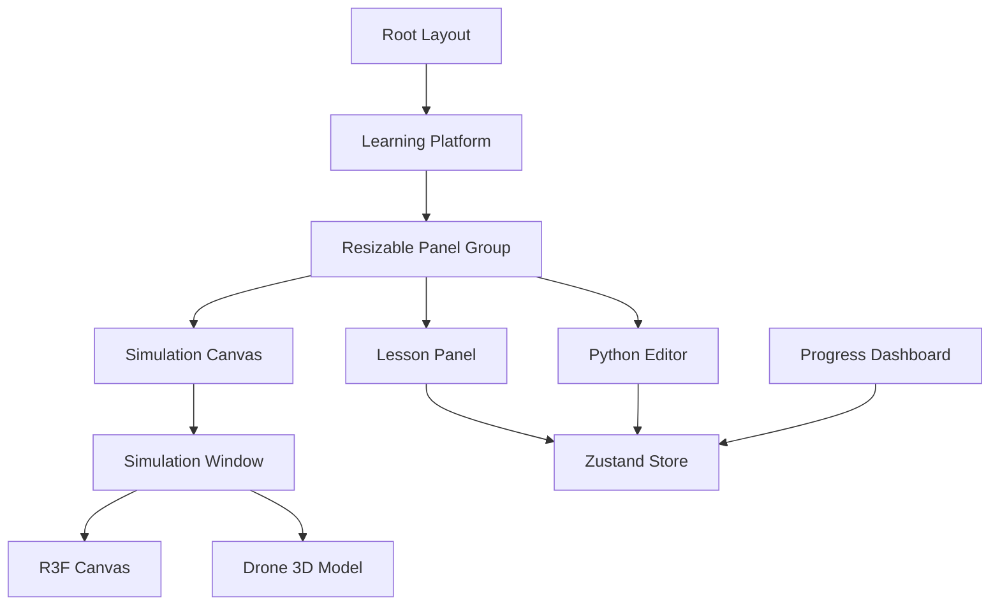

# Drone Programming Platform - Technical Specification

## 1. Executive Summary
The Drone Programming Platform is a comprehensive educational system designed to teach coding and robotics through interactive drone simulation. It features a structured curriculum, real-time assessment, and a progressive learning path from simulation to hardware.

## 2. Architecture Overview
The application is built using a modern React stack with Next.js 14, leveraging client-side rendering for the interactive components and server components for the skeleton.

### Core Stack
- **Framework**: Next.js 14 (App Directory)
- **UI Components**: ShadCN UI + Tailwind CSS
- **3D Engine**: React Three Fiber (Three.js)
- **State Management**: Zustand (with Persist middleware)
- **Language**: TypeScript

### Component Diagram


## 3. Data Schema

### Lesson Structure
Defined in `lib/lessons.ts`.
```typescript
interface Lesson {
  id: string; // e.g. "lesson_01"
  title: string;
  tier: 'beginner' | 'intermediate' | 'advanced';
  prerequisites: string[]; // IDs of required lessons
  locked: boolean;
  components: {
    theory: string; // Markdown supported
    codeTemplate: string; // Starter Python code
    successCriteria: {
      positionAccuracy?: number; // Meters
      minAttempts?: number;
      timeLimit?: number; // Seconds
    };
    hints: LessonHint[];
  };
}
```

### User State (Store)
Managed via `lib/store.ts` and persisted to localStorage.
```typescript
interface UserState {
  currentLessonId: string;
  completedLessons: string[]; // List of passed lesson IDs
  code: string; // Current editor content
  metrics: FlightMetrics; // Last flight performance
  mode: 'simulation' | 'hardware';
  
  // Actions
  setLesson: (id: string) => void;
  completeLesson: (id: string, metrics: FlightMetrics) => void;
  updateMetrics: (metrics: Partial<FlightMetrics>) => void;
}
```

## 4. User Flows

### Learning Flow
1. **Selection**: User selects a lesson from the **Lesson Panel**.
   - If locked, visual feedback is provided.
   - If unlocked, `currentLessonId` updates, and `code` is reset to the lesson's template.
2. **Coding**: User writes Python code in the **Code Editor**.
   - Code is validated for syntax.
3. **Execution**: User clicks "Simulate".
   - Code is parsed and moves the simulated drone in **Simulation Canvas**.
   - Metrics (accuracy, time) are tracked in real-time.
4. **Assessment**:
   - Upon mission completion (landed), metrics are evaluated against `successCriteria`.
   - If passed, `completeLesson` is called, unlocking the next lesson.
   - User receives success feedback in the Console.

## 5. Implementation Roadmap

### Phase 1 (MVP) - Completed
- [x] Project Structure Setup (Next.js, Tailwind)
- [x] Core Components (Editor, Simulation, Lesson Panel)
- [x] State Management (Zustand)
- [x] Simulation Engine Integration
- [x] Beginner Curriculum (10 Lessons structure)

### Phase 2 - Advanced Features
- [ ] Hardware Bridge (WebBluetooth / WebUSB)
- [ ] Advanced Analytics Dashboard with Charts
- [ ] Teacher/Classroom Management
- [ ] Multi-drone Simulation

### Phase 3 - Polish & scaling
- [ ] Internationalization (i18n)
- [ ] Cloud Sync (Firebase/Supabase)
- [ ] Mobile PWA Optimization

## 6. Offline Capabilities
The platform uses local storage for progress. For full offline support, a Service Worker will be added in Phase 2 to cache all static assets and 3D models.
